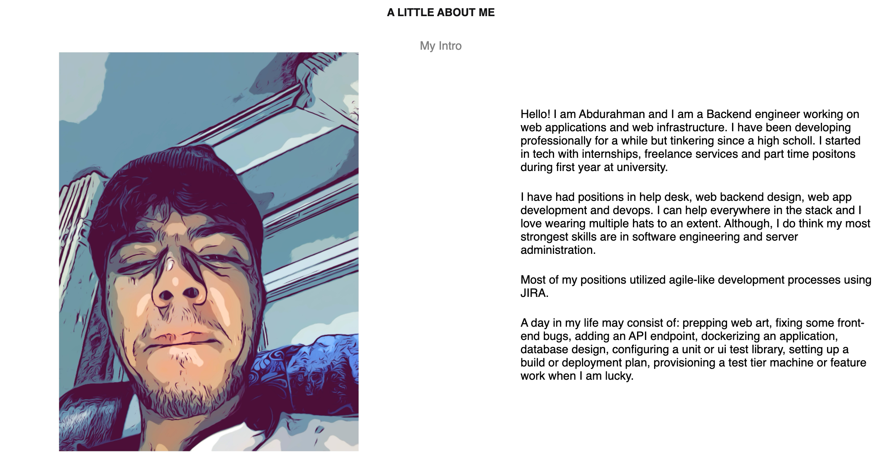

# My Profile

## Table of contents
- [My Profile](#my-profile)
  - [Table of contents](#table-of-contents)
  - [Sections](#sections)
    - [Header](#header)
    - [Landing](#landing)
    - [Skills](#skills)
    - [Contact](#contact)
    - [Join](#join)
  - [Website Link](#website-link)

## Sections

### Header
* Site header 
* Buttons for Home, Github and Contacts

### Landing
* Profile picture

* Go-throw description about my profile

### Skills
* listed my some skills i do use on my daily work

### Contact
* listed multiple contacts methods to get in touch with me

### Join
* listed my Twitter account to join me there

## Website Link
[MyCool Porfile site](https://abdulra7ma.github.io/profileee.github.io/)